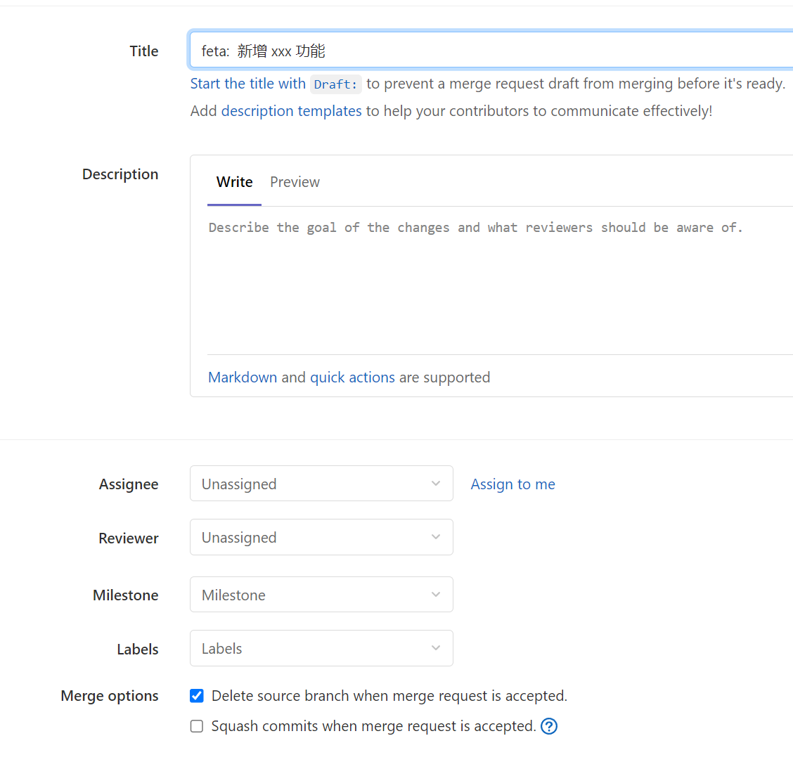

# Code Review 规范

code review 流程步骤：

1. 基于 develop 拉取功能分支
2. 在功能分支上进行任务开发
3. 合并代码前，先更新 develop 分支，然后切回功能分支使用 `git rebase develop` 将当前分支 rebase 到 develop 分支
4. 推送代码后，发起 `merge request`，并指定一个团队成员进行 code review
5. code review 完毕后，进行 code review 的团队成员需要点击 `approve` 后才允许进行合并

## 拉取新分支

在开始任务开发之前，本地拉取 develop 最新代码，并按照规范新建分支 `feature/功能名称-开发姓名`

```shell
git pull
git checkout -b feature/login-phl
```

## Rebase Develop

完成任务开发后，此时 develop 分支可能有其他人已经合并的新功能，且与自己的改动点冲突，如果不执行 rebase 操作，那么当合并请求时，可能会出现冲突。

当出现冲突时，`current change` 是 develop 的改动，`income change` 是自己的改动。具体操作如下：

```shell
# 在当前开发分支提交代码
git add .
git commit -m "feat: XXX"
git checkout develop
 ​
# 切换到 develop 分支，拉取最新代码
git pull
 ​
# 切换回个人的开发分支，执行 rebase
git checkout feature/login-phl
git rebase develop
 ​
# 如果有冲突，先按照实际情况解决所有冲突，然后重新提交代码并继续合并。
git add .
git rebase --continue
 
# 推送代码​
git push
```

## Merge Request

将分支推送到远程后，在分支上选择发起 `merge request` 请求.

1. 要确认选择的目标分支是 develop
2. Assignee 选择自己，必须选择一个 reviewer，选择项目组成员
3. merge options 按照实际需要选择
4. 检查 changed 文件，确保都是自己的改动，没有出现错误的改动



## Code Review

发送改动详情给选择的 review 人员，review 人员查看时，要注意以下几点：

1. `commit message` 描述 准确清晰，符合 git 规范
2. 同一个功能必须只有一个 commit 点，若多个 commit，则需要合并。一个合并请求可以包含多个功能或多个 commit
3. 改动点必须和 `commit message` 描述一致
4. 代码的编写格式和用法必须符合规范
5. 需要搞明白这次 MR 的功能是什么，如果不明白，请让代码提交人员讲清楚，有条件的话需要现场演示功能
