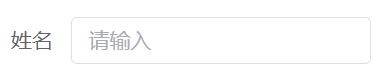
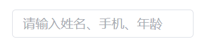

## loading 的作用与使用场景

### 作用

1. 防止重复请求。
2. 提示用户需要等待，避免因接口请求过慢，让用户以为页面无响应，从而提升用户体验。

### 使用场景

loading 又分为全局 loading 和局部 loading，它们的使用场景是有所不同的：

1. 全局 loading 在请求的时候无法进行其他操作。一般适用于纯数据展示页面，这种页面没数据就没什么用，所以适合全局 loading。
2. 局部 loading 在前端中使用场景比较多，一般通过点击按钮发起请求的操作都适合用局部 loading。

### 注意事项

1. 接口请求与 loading 都是结合使用的，所以对于 loading 的开启和关闭，通常放在请求拦截器中。
2. 页面切换时要取消所有未完成的请求，可以在路由守卫中实现。

### 如何实现

1. 封装一个 loading 变量，根据接口请求的开启与关闭，将它设为 `true` 或 `false`。这样在项目里的任何地方都可以通过它来判断是否有请求在进行，从而可以在恰当的时机展示 loading。**注意**，无论接口请求有多少个，在页面中始终只展示一个 loading。
2. 如果页面有多个请求需要在不同的时间发起，则第一点中封装的 loading 变量可能在这种情况下不适合使用。这时可以在当前页面自己创建一个 loading 变量，以满足特殊场景。
3. 为了在跳转页面时取消所有未完成的请求，我们需要在请求发起前的拦截器中对所有接口进行记录，记作 `pendingRequests`。在请求完成时将已完成的请求记录进行删除。这样在页面跳转时，只需要遍历并取消 `pendingRequests` 中的请求。

## 查询项 placeholder

如果查询项的 label 标签已经表明了这是什么搜索项，那输入框的 placeholder 就不需要重复提示该字段名称，只需要提示“请输入”或“请选择”。比如搜索姓名的输入框，如果左边的 label 已经写了姓名，那右边的输入框提示“请输入”即可。

如果查询项属于模糊查询，比如可以输入多个类型的关键词进行查询：姓名、手机、年龄等等，那么可以不需要 label，直接在输入框中提示“请输入姓名、手机、年龄”即可。

